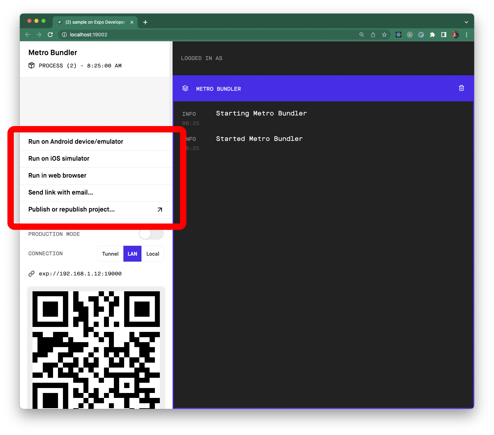

# Contributing

Thank you for contributing!

<a href="https://github.com/FormidableLabs/react-native-zephyr#maintenance-status">
  
</a>

React Native Zephyr is actively maintained by @[gksander][] from within [@FormidableLabs][formidable-github].

## Development

### Clone the repo

Start by cloning the repo from GitHub:

```shell
git clone git@github.com:FormidableLabs/react-native-zephyr.git
```

### Install Dependencies

Next, install the required dependencies:

```shell
yarn install
```

This will install the dependencies required to build the core and to run the sample application.

### Start the development server(s)

If you want to work on just the core of Zephyr, run the following to start up the TSC development server:

```shell
yarn dev:core
```

If you want to run both the core development server _and_ the sample Expo application, ensure you have `expo-cli` installed globally (`npm i -g expo-cli`) and then run:

```shell
yarn dev
```

This will start the TypeScript compiler to watch changes to the core code, and spin up the sample Expo application.

If you check your terminal, you should see an Expo link (perhaps `localhost:19002`) that you can open, which will open an Expo web dashboard:



From this web dashboard, you can fire up the sample application in a simulator/emulator or on a physical device.

When in development mode, changes you make to the core will be compiled on the fly. The sample application is linked to the development build so you can test your changes in realtime in the sample application.

### Running tests

To run the unit test suite, run:

```shell
yarn test
```

If you want to run the test suite in watch mode (very handle when doing development), run:

```shell
yarn test:watch
```

If you want to run the CI static analysis/unit test suite locally on your machine, run:

```shell
yarn check:ci
```


### Documentation Website

The documentation site for Zephyr is contained in this repo, but not part of the Yarn workspaces (to keep the dependencies isolated). If you want to spin up the docs site locally, run the following:

```shell
cd website # navigate to the `website` directory
yarn install # install the website dependencies
yarn start # start the dev server for the docs
```

The `website` folder contains all of the [Docusaurus](https://docusaurus.io/)-related code (which builds/configures the actual docs site). If you want to make changes to the layout/format of the docs site, make them in the `website` directory.

The `docs` directory contains all of the actual content for the docs site. If you want to make content changes to the docs, make them in the `docs` directory.


### Before submitting a PR

Thanks for taking the time to help us make React Native Zephyr even better! Before you go
ahead and submit a PR, make sure that you have done the following:

- Run all checks using `yarn check:ci`.
- Everything else included in our [pull request checklist](.github/PULL_REQUEST_TEMPLATE.md).

### Releasing a new version to NPM

<details>
<summary>
<i>Only for project administrators</i>
</summary>

This guide is for those with proper access to the GH repo and NPM registry package, and outlines the steps for publishing a new release. Follow the below instructions, running all commands from the root of the repository.

1. Update `CHANGELOG.md`, following the format of the previous versions.
  1. Commit as `Changes for version ${VERSION}`
2. Run `yarn run version patch` (or `minor|major`) to tag a new version.
3. Run `yarn publish:core` to publish the package to NPM.
4. Run `git push && git push --tags`

</details>

## Contributor Covenant Code of Conduct

### Our Pledge

In the interest of fostering an open and welcoming environment, we as
contributors and maintainers pledge to make participation in our project and
our community a harassment-free experience for everyone, regardless of age, body
size, disability, ethnicity, gender identity and expression, level of experience,
nationality, personal appearance, race, religion, or sexual identity and
orientation.

### Our Standards

Examples of behavior that contributes to creating a positive environment
include:

- Using welcoming and inclusive language
- Being respectful of differing viewpoints and experiences
- Gracefully accepting constructive criticism
- Focusing on what is best for the community
- Showing empathy towards other community members

Examples of unacceptable behavior by participants include:

- The use of sexualized language or imagery and unwelcome sexual attention or
  advances
- Trolling, insulting/derogatory comments, and personal or political attacks
- Public or private harassment
- Publishing others' private information, such as a physical or electronic
  address, without explicit permission
- Other conduct which could reasonably be considered inappropriate in a
  professional setting

### Our Responsibilities

Project maintainers are responsible for clarifying the standards of acceptable
behavior and are expected to take appropriate and fair corrective action in
response to any instances of unacceptable behavior.

Project maintainers have the right and responsibility to remove, edit, or
reject comments, commits, code, wiki edits, issues, and other contributions
that are not aligned to this Code of Conduct, or to ban temporarily or
permanently any contributor for other behaviors that they deem inappropriate,
threatening, offensive, or harmful.

### Scope

This Code of Conduct applies both within project spaces and in public spaces
when an individual is representing the project or its community. Examples of
representing a project or community include using an official project e-mail
address, posting via an official social media account, or acting as an appointed
representative at an online or offline event. Representation of a project may be
further defined and clarified by project maintainers.

### Enforcement

Instances of abusive, harassing, or otherwise unacceptable behavior may be
reported by contacting the project team at coc@formidable.com. All
complaints will be reviewed and investigated and will result in a response that
is deemed necessary and appropriate to the circumstances. The project team is
obligated to maintain confidentiality with regard to the reporter of an incident.
Further details of specific enforcement policies may be posted separately.

Project maintainers who do not follow or enforce the Code of Conduct in good
faith may face temporary or permanent repercussions as determined by other
members of the project's leadership.

### Attribution

This Code of Conduct is adapted from the [Contributor Covenant][cc-homepage], version 2.0,
available at [https://www.contributor-covenant.org/version/2/0][cc-latest-version]

<!-- Links -->

[gksander]: https://www.github.com/gksander
[cc-homepage]: http://contributor-covenant.org
[cc-latest-version]: https://www.contributor-covenant.org/version/2/0/code_of_conduct
[formidable-github]: https://www.github.com/FormidableLabs
