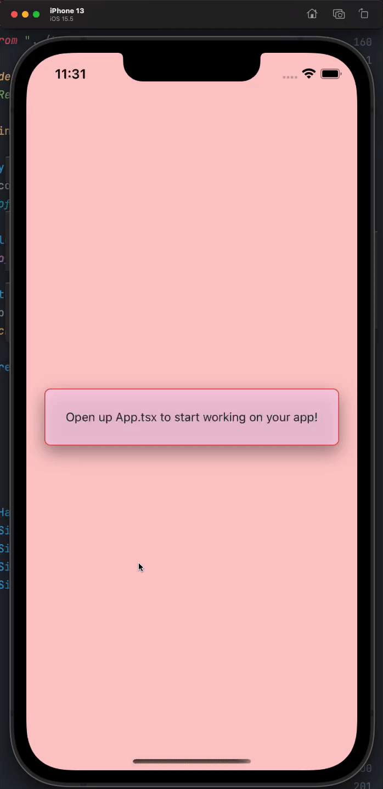

# PROTO: RN Styling Library

Okay, so hear me out. What if you could write RN markup like this:

```tsx
<StyleProvider>
  <StyledSafeAreaView
    bg="red-200"
    bg__dark="red-800"
    flex="1"
    items="center"
    justify="center"
    p="6"
  >
    <StyledTouchableOpacity
      p="6"
      bg="pink-200"
      bg__dark="pink-800"
      bg-opacity="80"
      rounded="lg"
      border="1"
      border-color="red-500"
      shadow="2xl"
      accessibilityHint="Just to show you the rest of props are here"
    >
      <StyledText color="gray-800" color__dark="gray-300">
        Open up App.tsx to start working on your app!
      </StyledText>
    </StyledTouchableOpacity>
  </StyledSafeAreaView>
</StyleProvider>
```

and could create something like this: 



This prototype is an attempt at that. It's going _alright_.
