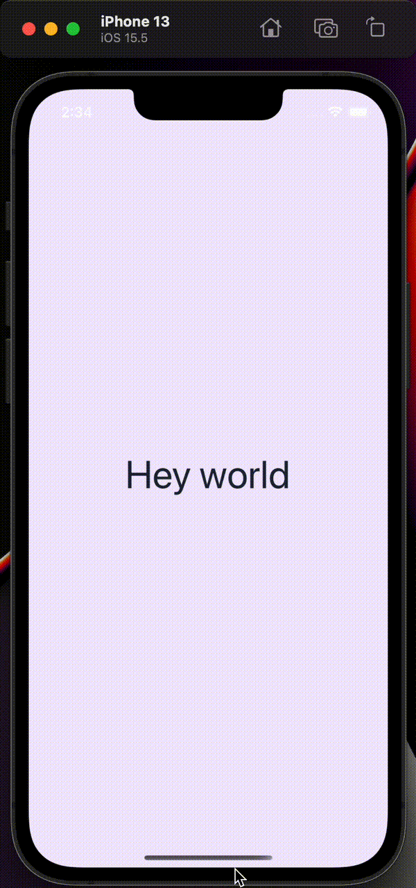

# Dark Mode Support

Style Buddy supports dark mode out of the box using the `useStyles` and `makeStyledComponent` style helpers returned from `createStyleBuddy`. Both accept arguments `classes` and `darkClasses` that indicate:

- the baseline `classes` to apply;
- and the `darkClasses` to _merge_ into the baseline `classes` if the user's color scheme preference is "dark".

Here's a simple example:

```tsx
import { createStyleBuddy } from "react-native-zephyr";
import { View, Text } from "react-native";

// Setup your style buddy and helpers
export const { makeStyledComponent } = createStyleBuddy();
export const StyledView = makeStyledComponent(View);
export const StyledText = makeStyledComponent(Text);

const App = () => {
  return (
    <StyledView
      classes={["flex:1", "bg:purple-100", "justify:center", "items:center"]}
      // 👇 gets merged into 👆 in dark mode.
      darkClasses={["bg:purple-800"]}
    >
      <StyledText
        classes={["text:5xl", "color:gray-800"]}
        darkClasses={["text:6xl", "color:gray-100"]}
      >
        Hey world
      </StyledText>
    </StyledView>
  );
};
```

This tiny bit of markup gives us something like the following.


<div style={{margin: "0px auto", maxWidth: "350px"}}>

  

</div>

## A note about `styles`

The `createStyleBuddy().styles` function can be used outside of the React component lifecycle (you can use it anywhere!). Because of this, it is not tuned into the user's color scheme preference – and therefore does not support dark mode features. However, both `useStyles` and `makeStyledComponent` support dark mode, as they are away of this setting.

## Manually setting Color Scheme

Your app should be wrapped in a top-level `StyleProvider` (from `react-native-zephyr`). This component has a `colorScheme?: "light" | "dark" | "auto"` prop that allows you to:

- explicitly force the app into "light" mode via `colorScheme="light"`;
- explicitly force the app into "dark" mode via `colorScheme="dark"`;
- or use the user's color scheme preference to determine which mode via `colorScheme="auto"` (this is the default behavior).

So if you'd like to only offer light mode to start, you could do the following:

```tsx
import { createStyleBuddy, StyleProvider } from "react-native-zephyr";
import { View } from "react-native";

// Setup your style buddy and helpers
export const { makeStyledComponent } = createStyleBuddy();
export const StyledView = makeStyledComponent(View);

// Root app component
export const App = () => {
  return (
    // 👇 will force the app into "light" mode, regardless of device color scheme preference
    <StyleProvider colorScheme="light">
      <AppBody />
    </StyleProvider>
  );
}

// Somewhere inside your root app component
const AppBody = () => {
  return (
    <StyledView
      classes={["bg:blue-100"]}
      // 👇 will never be applied, regardless of device color scheme preference
      darkClasses={["bg:blue-800"]}
    />
  );
}
```
