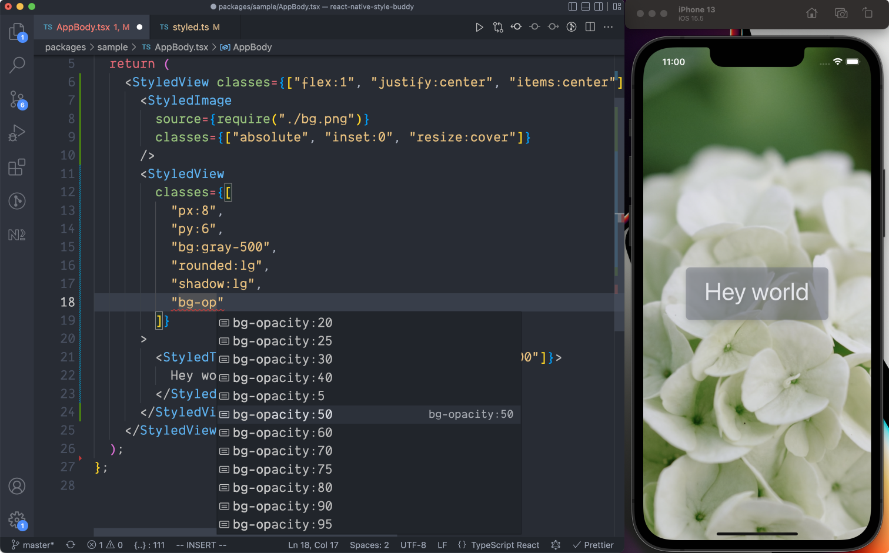

# Overview

React Native Style Buddy is a [TailwindCSS](https://tailwindcss.com)-esque styling library for React Native.

TailwindCSS is a brilliant library, but it's built for CSS and the web browser – and these are tools that are not available in React Native projects. This project aims to borrow some of the core ideas of TailwindCSS and implement them in the context of React Native applications.  

React Native Style Buddy, out of the box, provides:

- a thorough set of [built-in styling utilities](./default-handlers.md) (spacing, colors, typography, etc.);
- an [extendable and overridable theming system](./extending-the-theme.md);
- **type-safety** for speedy and confident development;
- [dark-mode support](./dark-mode.mdx) out of the box;
- [clsx-like syntax](./dynamic-classname-list.md) for applying dynamic style classes.

With zero customization, you can quickly build UIs with *type-inference*, showcased below.

## Let's get you started

Okay, go check out [the Quick Start guide](./quick-start.md) to give React Native Style Buddy a try.
