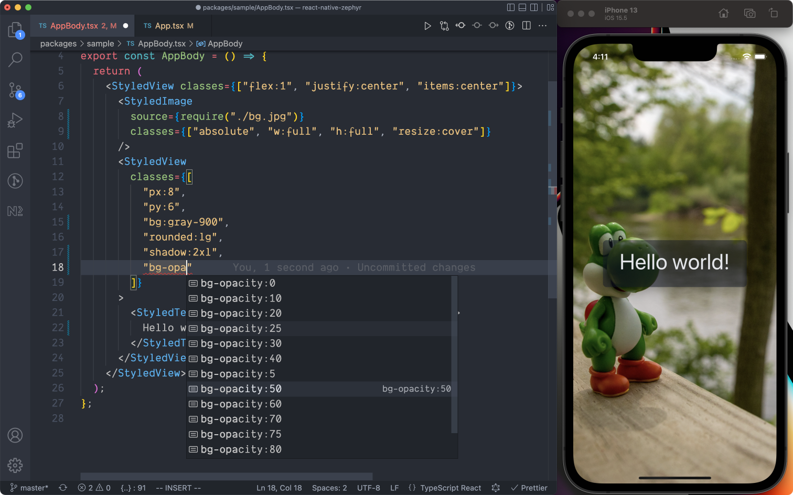

# Overview

React Native Zephyr is a [TailwindCSS](https://tailwindcss.com)-inspired styling library for React Native.

TailwindCSS is a brilliant library, but it's built for CSS and the web browser – and these are tools that are not available in React Native projects. This project aims to borrow some of the core ideas of TailwindCSS and implement them in the context of React Native applications.  

React Native Zephyr, out of the box, provides:

- a thorough set of [built-in styling utilities](./default-handlers.md) (spacing, colors, typography, etc.);
- an [extendable and overridable theming system](./extending-the-theme.md);
- **type-safety** for speedy and confident development;
- [dark-mode support](./dark-mode.mdx) out of the box;
- [clsx-like syntax](./dynamic-classname-list.md) for applying dynamic style classes.

With zero customization, you can quickly build UIs with *type-inference*, showcased below.

## How does it work?

Zephyr provides a default theme that you can extend. Zephyr uses your customized theme to generate helper "classes" that you can apply to generate React Native styles, almost as if they were utility CSS classes.

Under the hood, Zephyr is generating styles on the fly based on the classes you provide and caching the results. This entails that Zephyr:

- provides convenient syntax for styling, as if you were using utility CSS classes;
- provides loads of useful, built-in styling utilities (say goodbye to hand-rolling shadow styles);
- is memory-friendly, as no style objects are generated/cached until you use them.

We've leveraged the :sparkles:magic:sparkles: of TypeScript and TypeScript template literal strings to provide a type-safe authoring experience. This affords you:

- the ability to perform static analysis on the Zephyr classes you provide to elements;
- the convenience of editor autocomplete. :yum:

Not convinced yet? Give it a shot by checking [our Quick Start guide](./quick-start.md)!
