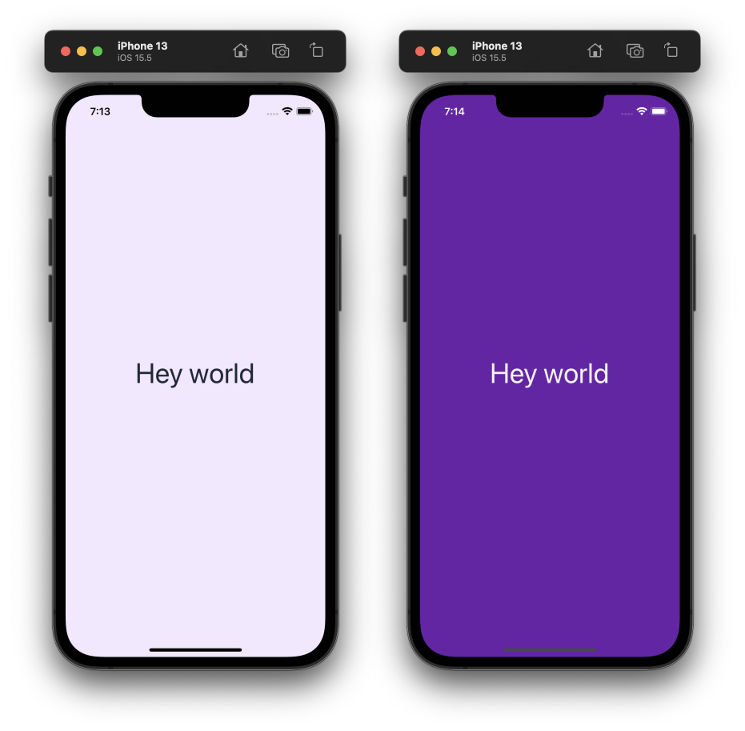

import Tabs from '@theme/Tabs';
import TabItem from '@theme/TabItem';

# Quick Start

Zephyr consists of a core method `createStyleBuilder` that allows you to customize your theme, add some extra style handlers, and it will return styling helpers to make your life easier.

## Step 1: Installation

In your React Native (or Expo) project, install the Zephyr library:


<Tabs>
<TabItem value="npm" label="NPM">

```sh
npm install react-native-zephyr
```

</TabItem>
<TabItem value="yarn" label="Yarn">

```sh
yarn add react-native-zephyr
```

</TabItem>
<TabItem value="pnpm" label="pnpm">

```sh
pnpm add react-native-zephyr
```

</TabItem>
</Tabs>

See the [Installation guide](./installation.mdx) for more details on installation.

## Step 2: Wrap your app in a `StyleProvider`

Then wrap your app in a `StyleProvider` instance, which is used by Zephyr under the hood (for things such as dark mode support).

```tsx title="App.tsx"
import { StyleProvider } from "react-native-zephyr";

export const App = () => {
  return (
    <StyleProvider>
      {/* The rest of your app body... */}
    </StyleProvider>
  );
};
```

## Step 3: Create a Zephyr

Then use the `createStyleBuilder` method to generate styling helpers. We recommend you have a single Zephyr instance for your entire app, so it's best to create your buddy in a dedicated file and export what you need for the rest of your app to consume.

```ts title="styles.ts"
import { createStyleBuilder } from "react-native-zephyr";

export const { styles, useStyles, makeStyledComponent } = createStyleBuilder();
```

These three styling helpers work similarly under the hood, and can be used in various scenarios. We'll start by wrapping some standard React Native UI components with our `makeStyledComponent` helper so that we can hit the ground running.

```ts title="styles.ts"
import { createStyleBuilder } from "react-native-zephyr";
// highlight-next-line
import { View, Text } from "react-native";

export const { styles, useStyles, makeStyledComponent } = createStyleBuilder();

// Export some styled components
// highlight-start
export const StyledView = makeStyledComponent(View);
export const StyledText = makeStyledComponent(Text);
// highlight-end
```

These new, wrapped components (`StyledView` and `StyledText`) expose `classes` and `darkClasses` props that allow you to pass in baseline style classes, as well as style classes to be merged in in dark mode. 

## Step 4: Start styling!

With your new style helpers (see [Default Handlers](./default-handlers.md) for more info on style classes you get out of the box), you can quickly style elements.

```tsx title="MyComponent.tsx"
import * as React from "react";
import { StyledView, StyledText } from "./styles";

export const MyComponent = () => {
  return (
		// highlight-start
    <StyledView
      classes={["flex:1", "bg:purple-100", "justify:center", "items:center"]}
      darkClasses={["bg:purple-800"]}
    >
      <StyledText
        classes={["text:5xl", "color:gray-800"]}
        darkClasses={["text:6xl", "color:gray-100"]}
      >
        // highlight-end
        Hey world
      </StyledText>
    </StyledView>
  );
}
```

This small amount of React will generate the following (left: in light mode, right: in dark mode).



### Using `styles` and `useStyles`

The `createStyleBuilder` function returns three core utilities that you can use for styling:

- `styles` is a function with no reliance on React's component lifecycle, and can be used to generate a React Native style object based on the style classes you provided it. However, it does not support dark-mode (since it is not tuned into your React app).
- `useStyles` is a React hook that allows you to pass style classes for the baseline case as well as for dark mode, and returns a React Native style object. You can then apply the returned style to an element in your component.
- `makeStyledComponent` is a HOC that turns a component into a "styled" component. The wrapped component will then have `classes` and `darkClasses` props that you can use to apply style classes.

We recommend using `makeStyledComponent` to export reusable styled components (such as `StyledView` above), but the additional `styles` and `useStyles` offer you additional flexibility if you do not want to wrap your components.


## Step 5: Customizing your theme

Zephyr ships with a suite of [default handlers](./default-handlers.md) that use the [default theme](./default-theme.md) to create the applicable style "classes" (such as `"w:4"`). This default theme is overridable and extendable. To override the default theme constraints, you can pass a `overrideTheme` argument to `createStyleBuilder`.

```ts
import { createStyleBuilder } from "react-native-zephyr";

const { styles } = createStyleBuilder({
  overrideTheme: {
    spacing: { sm: 4, md: 8, lg: 16 }
  }
});

// Now the spacing helpers, like m: and p:, use the spacing constraints above.
styles("px:sm", "py:md", "m:lg");
```

Note that by passing a constraints field, such as `spacing` or `colors`, you'll override the respective default theme constraints. See [Extending the theme](./extending-the-theme.md) for more details on how this works. If you want to just _extend_ the default theme constraints, use the `extendTheme` parameter.

```ts
import { createStyleBuilder } from "react-native-zephyr";

const { styles } = createStyleBuilder({
  extendTheme: {
    colors: { brand: "#ff00ff" }
  }
});

// The default colors are available, alongside your added colors.
styles("color:red-300", "bg:brand");
```

## Step 6: Adding style handlers

Zephyr allows you to add your own custom style handlers, so you can break free from the default handlers and add your own if you so desire.

Each custom handler of the form `f: x => y` will generate a set of style names of the form `f:x`; each handler of the form `f: () => y` will generate a single style name `f`.

```ts
import { createStyleBuilder } from "react-native-zephyr";

const { styles } = createStyleBuilder({
  // Add some extra handlers
  extraHandlers: {
    size: (x: "small" | "big") => ({ width: x === "small" ? 8 : 64 }),
    foo: () => ({ backgroundColor: "brown" })
  }
});

// You now have some additional style classes, along with the default ones
styles("size:small", "size:large", "foo");
```
